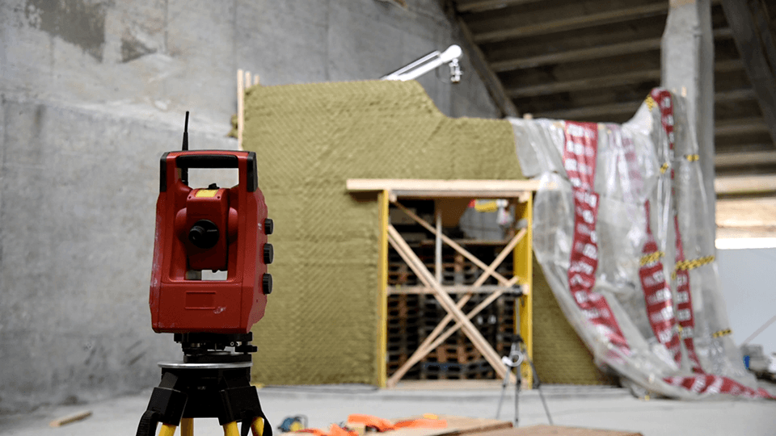

# COMPAS Mobile Robot Relocalization

Robot localization using external measuring device (total station).


[](https://pypi.org/project/compas-mobile-robot-reloc)
[](https://anaconda.org/conda-forge/compas_mobile_robot_reloc)



Photo from video shot by
[MASDFAB 1920 team](https://www.masdfab.com/2019-20-t3-mas-dfab).

* [Documentation](https://gramaziokohler.github.io/compas_mobile_robot_reloc)
* [Issue tracker](https://github.com/gramaziokohler/compas_mobile_robot_reloc)

## Sources

Code adapted from source code by Selen Ercan and Sandro Meier at [Gramazio
Kohler Research](https://gramaziokohler.arch.ethz.ch/), ETH Zurich (2019).

Original code:
[gramaziokohler/IF_jamming/if_jamming/localization](https://github.com/gramaziokohler/IF_jamming/blob/master/if_jamming/localization/)


### Citing

> Ercan, Selen, Sandro Meier, Fabio Gramazio, and Matthias Kohler. 2019.
> "Automated Localization of a Mobile Construction Robot with an External
> Measurement Device." *In Proceedings of the 36th International Symposium on
> Automation and Robotics in Construction (ISARC 2019)*, 929-36. International
> Association on Automation and Robotics in Construction.
> https://doi.org/10.3929/ethz-b-000328442.

```bibtex
@inproceedings{ercan_automated_2019,
	title = {Automated {Localization} of a {Mobile} {Construction} {Robot} with an {External} {Measurement} {Device}},
	copyright = {http://rightsstatements.org/page/InC-NC/1.0/},
	url = {https://www.research-collection.ethz.ch/handle/20.500.11850/328442},
	doi = {10.3929/ethz-b-000328442},
	language = {en},
	booktitle = {Proceedings of the 36th {International} {Symposium} on {Automation} and {Robotics} in {Construction} ({ISARC} 2019)},
	publisher = {International Association on Automation and Robotics in Construction},
	author = {Ercan, Selen and Meier, Sandro and Gramazio, Fabio and Kohler, Matthias},
	year = {2019},
	note = {Accepted: 2019-09-11T08:51:48Z},
	pages = {929--936},
}
```
